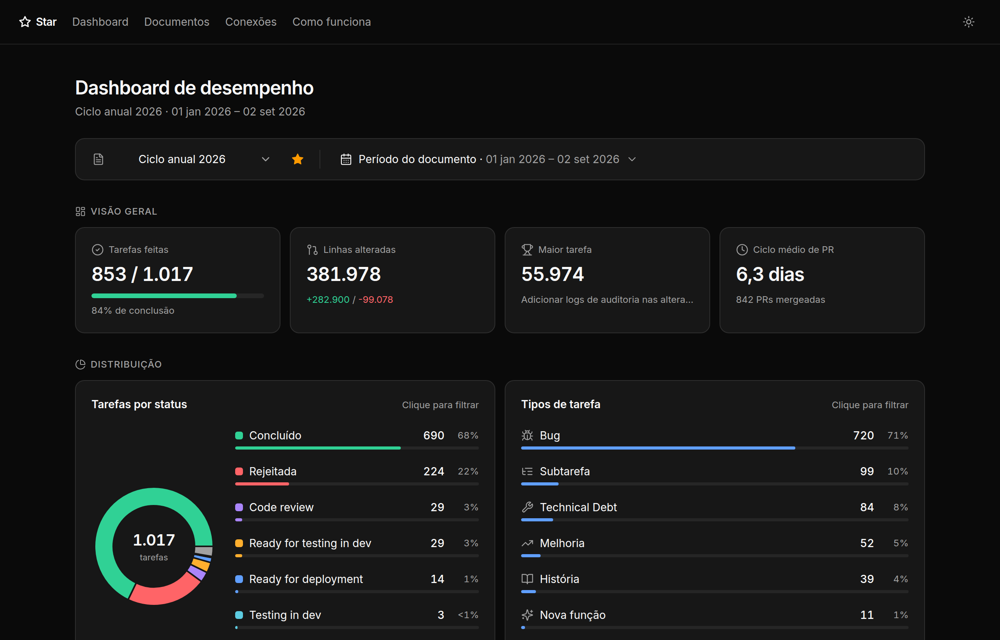
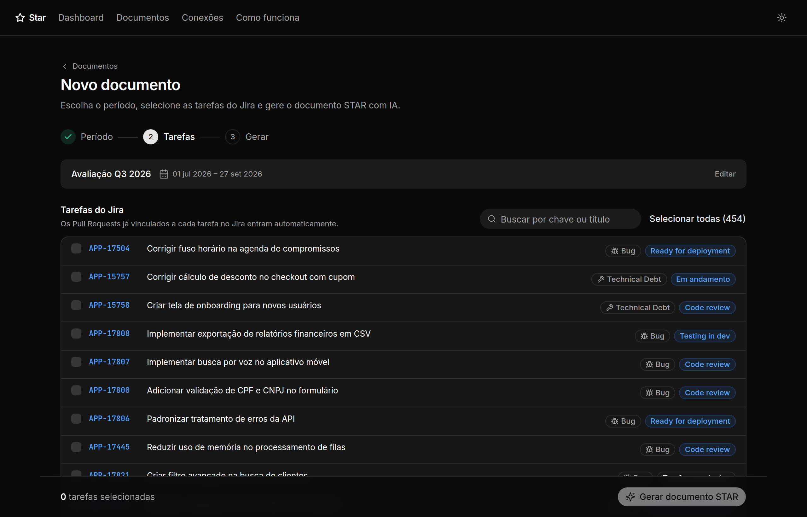
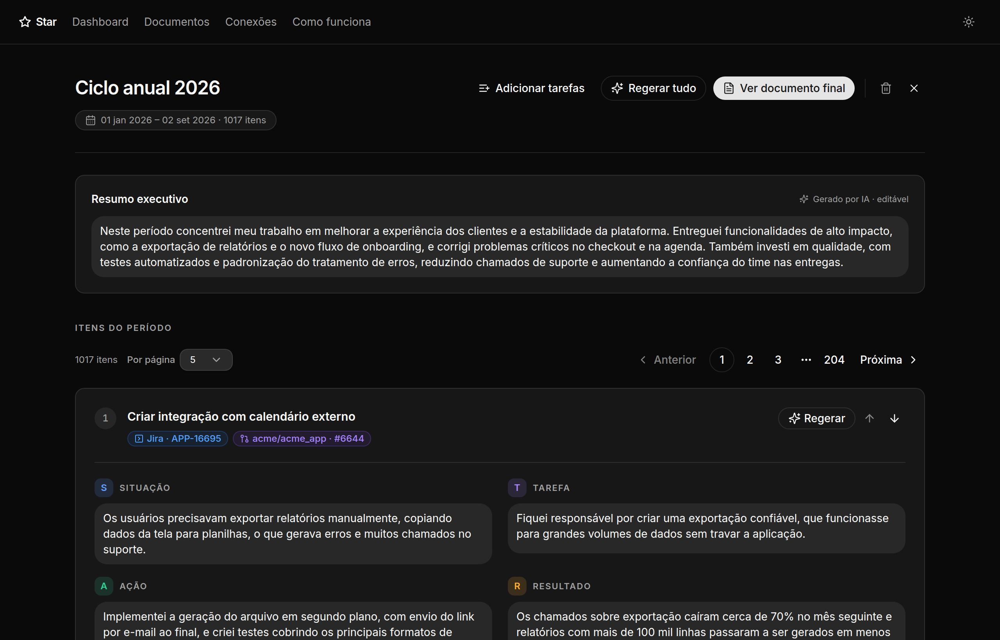
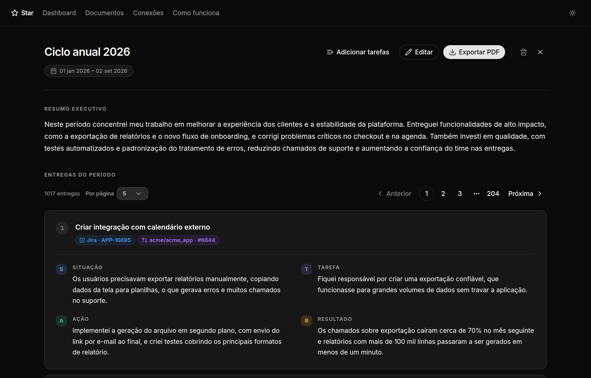
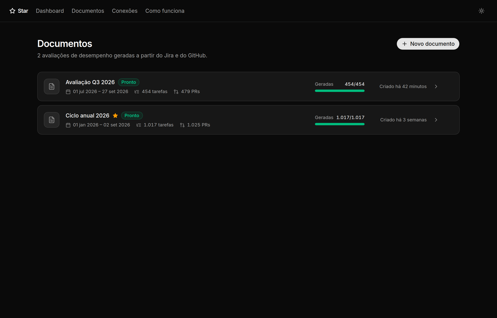
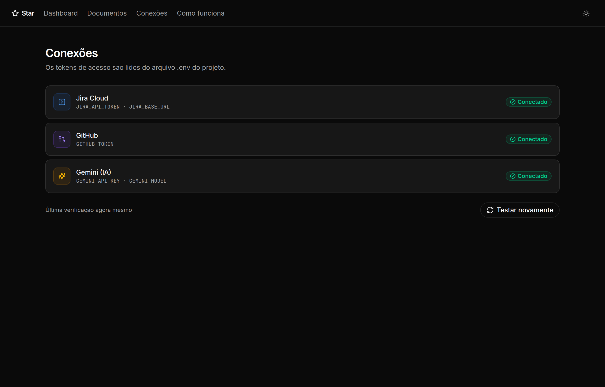

# Star

Aplicação pessoal para gerar documentos de avaliação de desempenho no formato
**STAR** (Situação, Tarefa, Ação, Resultado), a partir das suas tarefas do
**Jira Cloud** e **Pull Requests** no **GitHub**.

Uso pessoal, single-user, sem login, roda 100% local via Docker.

## Funcionalidades

- **Como funciona**: aba com um guia rápido do app e do método STAR, voltado
  para quem está usando pela primeira vez.
- **Conexões**: verifica se Jira, GitHub e Gemini estão configurados
  corretamente no `.env`.
- **Novo documento**: escolha o período (com atalhos prontos), filtre por
  status, prioridade e tipo, e selecione as tarefas do Jira. Os Pull Requests
  ligados a cada tarefa são incluídos automaticamente.
- **Geração com IA**: para cada tarefa é gerado um texto STAR em primeira
  pessoa; os itens são ordenados por impacto e é criado um resumo executivo.
  O processamento roda em segundo plano.
- **Revisão**: edite os textos, gere novamente um item ou o documento todo,
  reordene os itens e adicione novas tarefas a um documento existente.
- **Documento final**: visualização pronta para leitura e exportação em PDF.
- **Dashboard**: métricas de um documento por vez (tarefas feitas, linhas
  alteradas, maior tarefa, ciclo médio de PR, gráficos por status, tipo e
  mês), com filtros por período, status e tipo e um documento favorito.

## Telas

### Dashboard


### Novo documento — seleção de tarefas do Jira


### Revisão do documento


### Documento final


### Documentos


### Conexões


> Os prints usam dados fictícios.

## Stack

- **Backend**: NestJS + TypeORM + Zod, em arquitetura **DDD** (domain / application / infrastructure / presentation)
- **Frontend**: React + Vite + Tailwind CSS + shadcn/ui + react-router-dom + recharts
- **Banco**: MariaDB (container Docker)
- **IA**: API do Gemini (geração dos textos STAR, ordenação por impacto e resumo executivo)

## Pré-requisitos

- Docker e Docker Compose instalados
- Uma API key do Gemini: https://aistudio.google.com/app/apikey
- Um API token do Jira Cloud: https://id.atlassian.com/manage-profile/security/api-tokens
- Um Personal Access Token do GitHub (permissão de leitura em `repo`): https://github.com/settings/tokens

## Como rodar

1. Copie o arquivo de exemplo de variáveis de ambiente:

   ```bash
   cp .env.example .env
   ```

2. Preencha o `.env` com seus tokens reais (`JIRA_DOMAIN`, `JIRA_EMAIL`,
   `JIRA_API_TOKEN`, `GITHUB_TOKEN`, `GEMINI_API_KEY`).

3. Suba os containers:

   ```bash
   docker compose up --build
   ```

4. Acesse:
   - Frontend: http://localhost:5173
   - Backend (API): http://localhost:3000

O banco de dados MariaDB é criado automaticamente (schema sincronizado via
TypeORM `synchronize: true` — adequado para uso pessoal/local, sem
necessidade de migrations manuais no MVP).

Os containers montam o código via volume e fazem hot reload, então não é
preciso rebuildar as imagens após editar o código — só ao mudar `Dockerfile`,
dependências ou `docker-compose.yml`.

## Estrutura do projeto

```
star/
├── docker-compose.yml
├── .env.example
├── AGENTS.md             # instruções para agentes de IA
├── backend/              # NestJS — arquitetura DDD
│   └── src/
│       ├── documents/    # bounded context principal
│       │   ├── domain/           # entidades, value objects, regras de negócio
│       │   ├── application/      # use cases, portas (interfaces), DTOs (Zod)
│       │   ├── infrastructure/   # TypeORM, pdfkit
│       │   └── presentation/     # controllers HTTP
│       ├── dashboard/    # métricas do dashboard (mesmo padrão de camadas)
│       ├── jira/         # integração Jira Cloud (mesmo padrão de camadas)
│       ├── github/       # integração GitHub (mesmo padrão de camadas)
│       ├── ai/           # implementação da geração de texto via Gemini
│       ├── common/       # filtros de exceção e pipes compartilhados
│       └── database/     # configuração do TypeORM/MariaDB
└── frontend/             # React + Vite
    └── src/
        ├── pages/        # Dashboard, Documentos, Novo documento, Revisão,
        │                 # Documento final, Adicionar tarefas, Conexões, Como funciona
        ├── components/   # componentes do app + ui/ (shadcn/ui)
        └── lib/          # cliente da API, contexto de geração, utilitários
```
